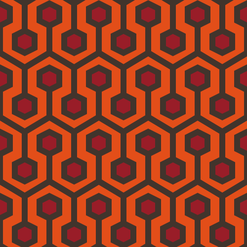
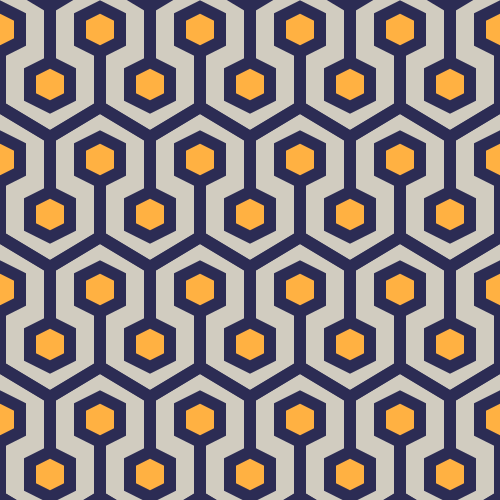
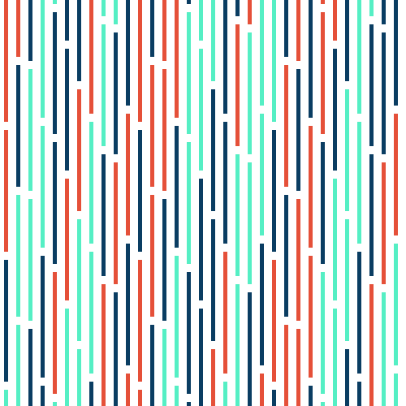
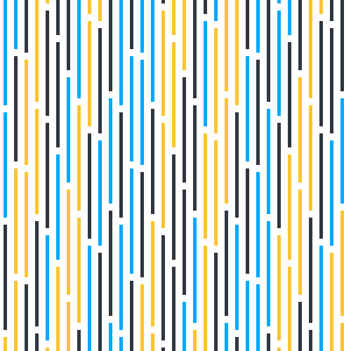
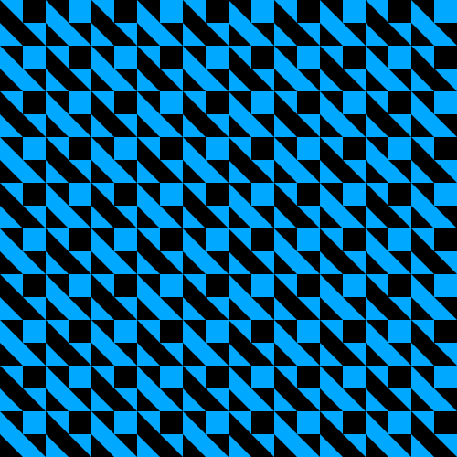
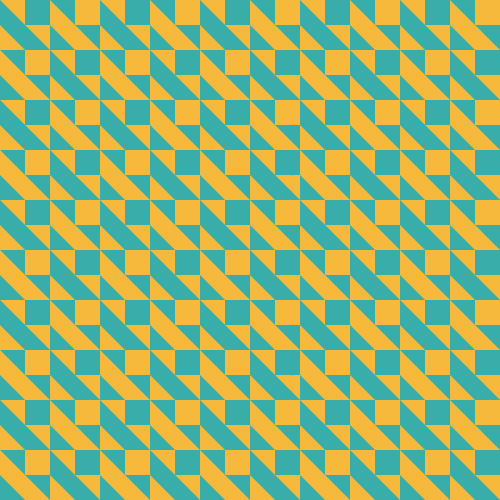
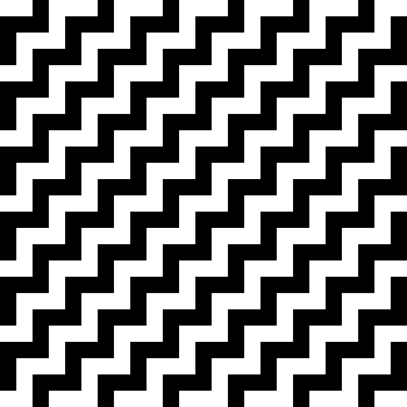
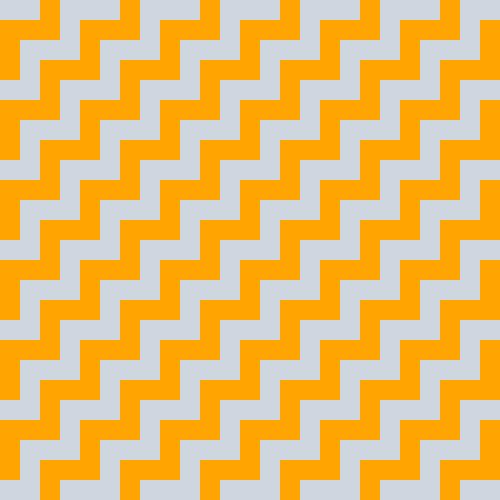
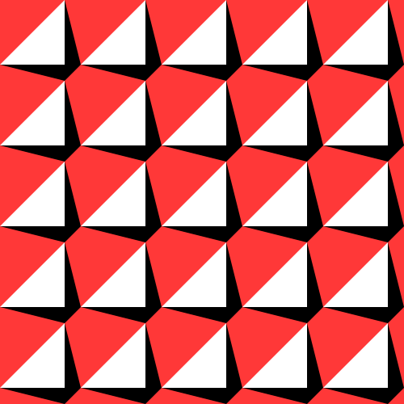

# konstrukt

A simple commandline tool to generate SVGs roughly fitting the area of [concrete art](https://en.wikipedia.org/wiki/Concrete_art).

## Usage

This sections shows example usage of the implemented commands.

### Shining

The pattern of the carpet in the shining (code initially implemented [here](https://github.com/ajstarks/svgo-workshop/blob/master/code/svgplay-samples/shining.go)) can be easily generated and recolored with konstrukt.

<details>
<summary>Usage examples</summary>

The original output can be generated with:
```
konstrukt gen shining
```



Changing the colors can be easily done like this:
```
konstrukt gen shining --foreground "#2c2c54" --background "#d1ccc0" --accent "#ffb142" --filename shining-spanish.svg
```



</details>

### Interruptions

The pattern and default implementation is inspired by [Horst Bartnigs](https://de.wikipedia.org/wiki/Horst_Bartnig) collection of works titled `72 Unterbrechungen`.

<details>
<summary>Usage examples</summary>

The default can be generated with:
```
konstrukt gen interruptions
```



Changing the colors can be easily done like this:
```
konstrukt gen interruptions --color1 "#00a8ff" --color2 "#2f3640" --color3 "#fbc531" --filename interruptions-british.svg
```



</details>

### Quadrat

The pattern and default implementation is inspired by [Horst Bartnigs](https://de.wikipedia.org/wiki/Horst_Bartnig) work titled `8 blaue und 8 schwarze Quadrate`.

<details>
<summary>Usage examples</summary>

The default can be generated with:
```
konstrukt gen quadrat
```



Changing the colors can be easily done like this:
```
konstrukt gen quadrat --color1 "#f6b93b" --color2 "#38ada9"  --filename quadrat-french.svg
```



</details>

### Janein

The pattern and default implementation is inspired by [Wolfgang Bosses](https://kulturanalyse.de//wolfgang_bosse/index.html) work titled `JA-NEIN`.

<details>
<summary>Usage examples</summary>

The default can be generated with:
```
konstrukt gen janein
```



Changing the colors can be easily done like this:
```
konstrukt gen janein --color1 "#ced6e0" --color2 "#ffa502"  --filename janein-cn.svg
```



</details>

### Fiftyfive

The pattern and default implementation is inspired by [Julia Breunigs](https://juliaskonkretekunst.wordpress.com/) work titled `Bild Nr. 55`.

<details>
<summary>Usage examples</summary>

The default can be generated with:
```
konstrukt gen fiftyfive
```



Changing the colors can be easily done like this:
```
konstrukt gen fiftyfive --color1 "#cd84f1" --color2 "#4b4b4b" --color3 "#ffaf40"  --filename fiftyfive-tr.svg
```


</details>
