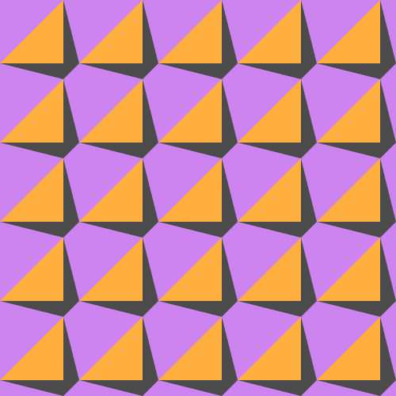

# konstrukt

A simple commandline tool to generate SVGs roughly fitting the area of [concrete art](https://en.wikipedia.org/wiki/Concrete_art).

## Getting started

The `konstrukt` binary can be downloaded from [releases](https://github.com/MarcelMue/konstrukt/releases) section of this repository.
It is contained together with the [LICENSE](LICENSE) in a `.tar.gz` or `.zip` depending on the target operating system.

You can interact with `konstrukt` through your native [command line interface](https://en.wikipedia.org/wiki/Command-line_interface).

If you are unfamiliar with a command line then these examples should give you some guidance:
<details>
<summary>Using Windows</summary>
First download the latest `.zip` release from the releases page.

Unzip the archived files in a location of your choice (e.g. your `Downloads` folder).

Open a command line of your choice (e.g. `cmd.exe`).

Navigate tp the location of the unpacked `konstrukt` binary (e.g. `cd C:\Users\SomeUser\Downloads`).

Display the help text of `konstrukt` by calling it without arguments (`konstrukt.exe`).
The output should look like this:
```
Command line tool for generating konstruktive art.

Usage:
  konstrukt [flags]
  konstrukt [command]

Available Commands:
  gen         Generate files.
  help        Help about any command

Flags:
  -h, --help   help for konstrukt

Use "konstrukt [command] --help" for more information about a command.
```

Now you should be able to experiment with the usage examples below just remember to use `konstrukt.exe`!
</details>
<details>
<summary>Using Linux/MacOS</summary>
First download the correct `.tar.gz` release depending on your operating system from the releases page.

Unpack the `.tar.gz` in a location of your choice (e.g. your `Downloads` folder).

Open a terminal of your choice.

Navigate to the location of the unpacked `konstrukt` binary (e.g. `cd ~/Downloads`).

Display the help text of `konstrukt` by calling it without arguments (`./konstrukt`).
The output should look like this:
```
Command line tool for generating konstruktive art.

Usage:
  konstrukt [flags]
  konstrukt [command]

Available Commands:
  gen         Generate files.
  help        Help about any command

Flags:
  -h, --help   help for konstrukt

Use "konstrukt [command] --help" for more information about a command.
```

Now you should be able to experiment with the usage examples below!
</details>

## Usage

All commands allow for the following flags:
```
      --filename string   Name of the output file.
      --height int        Height of the output file in pixels. (default 500)
  -h, --help              help
      --randomize         Randomize all colors in the pattern, ignore other color flags.
      --width int         Width of the output file in pixels. (default 500)
```

Other flags for coloring patterns can be explored in the individual usage examples below.

### Shining

The pattern and default implementation is inspired by a carpet design by [David Nightingale Hicks](https://en.wikipedia.org/wiki/David_Nightingale_Hicks) commonly known as "Hicks' Hexagon".
It became known in popular culture as the pattern of the carpet in [The Shining](https://en.wikipedia.org/wiki/The_Shining_(film)).
The code for the pattern was initially implemented [here.](https://github.com/ajstarks/svgo-workshop/blob/master/code/svgplay-samples/shining.go)

<details>
<summary>Usage examples</summary>

The original output can be generated with:
```
konstrukt gen shining
```


Changing the colors can be easily done like this:
```
konstrukt gen shining --color3 "#2c2c54" --color2 "#d1ccc0" --color1 "#ffb142" --filename shining-es.svg
```


</details>

### Interruptions

The pattern and default implementation is inspired by [Horst Bartnigs](https://de.wikipedia.org/wiki/Horst_Bartnig) collection of works titled `72 Unterbrechungen`.

<details>
<summary>Usage examples</summary>

The default can be generated with:
```
konstrukt gen interruptions
```


Changing the colors can be easily done like this:
```
konstrukt gen interruptions --color1 "#00a8ff" --color2 "#2f3640" --color3 "#fbc531" --filename interruptions-br.svg
```


</details>

### Quadrat

The pattern and default implementation is inspired by [Horst Bartnigs](https://de.wikipedia.org/wiki/Horst_Bartnig) work titled `8 blaue und 8 schwarze Quadrate`.

<details>
<summary>Usage examples</summary>

The default can be generated with:
```
konstrukt gen quadrat
```


Changing the colors can be easily done like this:
```
konstrukt gen quadrat --color1 "#f6b93b" --color2 "#38ada9"  --filename quadrat-fr.svg
```


</details>

### Janein

The pattern and default implementation is inspired by [Wolfgang Bosses](https://kulturanalyse.de//wolfgang_bosse/index.html) work titled `JA-NEIN`.

<details>
<summary>Usage examples</summary>

The default can be generated with:
```
konstrukt gen janein
```


Changing the colors can be easily done like this:
```
konstrukt gen janein --color1 "#ced6e0" --color2 "#ffa502"  --filename janein-cn.svg
```


</details>

### Fiftyfive

The pattern and default implementation is inspired by [Julia Breunigs](https://juliaskonkretekunst.wordpress.com/) work titled `Bild Nr. 55`.

<details>
<summary>Usage examples</summary>

The default can be generated with:
```
konstrukt gen fiftyfive
```


Changing the colors can be easily done like this:
```
konstrukt gen fiftyfive --color1 "#cd84f1" --color2 "#4b4b4b" --color3 "#ffaf40"  --filename fiftyfive-tr.svg
```



</details>

### Ladysweat

The pattern and default implementation is inspired by [Joshua Blankenships](https://blankenship.xyz/) work titled `Lady Sweat Repeating Pattern`.

<details>
<summary>Usage examples</summary>

The default can be generated with:
```
konstrukt gen ladysweat
```


Changing the colors can be easily done like this:
```
konstrukt gen ladysweat --color1 "#303952" --color2 "#f8a5c2" --color3 "#778beb"  --filename ladysweat-ru.svg
```


</details>

### Modernhive

The pattern and default implementation is inspired by [Emma Methods](http://www.emmamethod.com/) work titled `modern hive`.

<details>
<summary>Usage examples</summary>

The default can be generated with:
```
konstrukt gen modernhive
```


Changing the colors can be easily done like this:
```
konstrukt gen modernhive --color1 "#B33771" --color2 "#55E6C1"  --filename modernhive-in.svg
```


</details>

### Swiss16

The pattern and default implementation is inspired by [Neo Geometrics](https://dribbble.com/vladikkk09) work titled `swiss-16`.

<details>
<summary>Usage examples</summary>

The default can be generated with:
```
konstrukt gen swiss16
```


Changing the colors can be easily done like this:
```
konstrukt gen swiss16 --color1 "#222f3e" --color2 "#5f27cd" --color3 "#1dd1a1"  --filename swiss16-ca.svg
```


</details>

### Interlocking

The pattern and default implementation is inspired by [Cami Dobrins](https://camidraws.com/) work titled `Interlocking Abstract Pattern Background`.

<details>
<summary>Usage examples</summary>

The default can be generated with:
```
konstrukt gen interlocking
```


Changing the colors can be easily done like this:
```
konstrukt gen interlocking --color1 "#f7f1e3" --color2 "#40407a" --color3 "#33d9b2"  --filename interlocking-es.svg
```


</details>

### Whitegold

The pattern and default implementation is [MarcelMues](https://github.com/MarcelMue) work titled `whitegold`.

<details>
<summary>Usage examples</summary>

The default can be generated with:
```
konstrukt gen whitegold
```


Changing the colors can be easily done like this:
```
konstrukt gen whitegold --color1 "#dff9fb" --color2 "#6ab04c"  --filename whitegold-au.svg
```


</details>

## Guidelines

Additions to this project should follow these guidelines:
- Patterns should be repeatable and scaleable.
- Patterns should be constant across the generated SVG (e.g. no convex pattern).
- All patterns should be made up of low count polygons (no curves or similar).
- Accurate citation should be given if a pattern was inspired by an artwork or artist.
